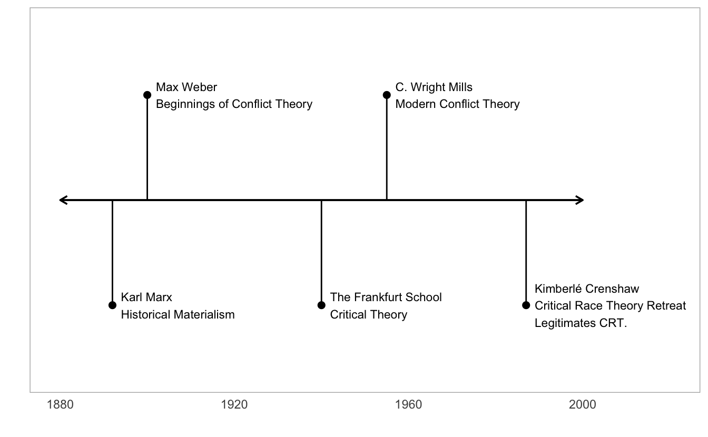

Before the United States created the Constitution, something called the [*Articles of Confederation*](https://history.state.gov/milestones/1776-1783/articles) defined what the US Government would look like. It was the first attempt at creating some sort of agreement between the 13 original states to form a central government. In the end, the Articles of Confederation made the new central government too weak to accomplish anything. Then, in 1787 representatives from each state met in Philadelphia to entirely scrap the Articles of Confederation in a meeting that became known as the [Constitutional Convention](https://history.state.gov/milestones/1784-1800/convention-and-ratification). They would then end up creating the Constitution of the United States of America which we all know today.

During this time, there were three main issues at hand. Representatives of the convention sought to give each state enough autonomy to function independently. They engaged in heated debated about how much power each state should be given and eventually, the issue of slavery --- (3) how would slaves be counted for tax and representation purposes?

The debate surrounding how much power (or representation) that would be given to each state in the new government was the source of much rancour at the convention. There were two leading ideas that addressed this problem. One of which was that each state would have an equal say regardless of its physical size or the number of people within it. The other was that each state would have power relative to their total population.

These ideas were presented as the [*New Jersey Plan*](https://en.wikipedia.org/wiki/New_Jersey_Plan) and the [*Virginia Plan*](https://en.wikipedia.org/wiki/Virginia_Plan). James Madison drafted the Virginia Plan which also would be known as the "large-state-plan" and was intended to introduce proportional representation---effectively giving states with the most people the most power.

Small states, feeling threatened by this, introduced the New Jersey plan. The New Jersey plan was an attempt to level the playing field between small and big states. The New Jersey plan would give each state 1 vote in the new government and would allow states like Delaware to have as much weight in votes as big states.

In a move that would be known as the [Great Compromise](https://www.senate.gov/artandhistory/history/minute/A_Great_Compromise.htm) (or the Connecticut compromise), the representatives from Connecticut (a medium sized state) suggested that both ideas be put into effect. This idea created what is called a "bicameral legislature"---a legislative (law-making) body with two parts.

One part of the new government would provide equal representation for each of the states. This became known as the *Senate* which today has two representatives for each state. The other part of the new government became the *House of Representatives* (also known more generally as "Congress"). This new body gave each state *"one \[representative\] for every Thirty Thousand \[people\]"*. But as the US population grew so did the number of representatives in Washington DC. Eventually rules had to change to prevent the number of representatives from getting any more out of hand . Today, the House of Representatives has 435 congresspeople (more [here](https://en.wikipedia.org/wiki/United_States_congressional_apportionment#Past_increases)).

Though the Connecticut compromise was an act of genius, it also implemented one of most reprehensible policies in US history: *the 3/5ths compromise*. Slavery was the largest economic driving force in Southern states created by a seemingly endless supply of cost-free labor. Looking at the prospect of proportional representation, large slave owning states wanted each slave to be counted towards their population. For reference slaves composed 43% of the population of South Carolina, 41.6% of Virginia, 35.5% of Georgia, and 32% of North Carolina.

But there is one major catch, slaves were treated as property and not people. They were not given the same "inalienable rights" as everyone else. This was seen as unfair because slaves would not *actually* be *represented* in congress. If only free people were to be counted, that would punish slave holding states and empower Northern states.

Eventually representatives of the convention came to a solution, one that still haunts our country until this very day. It was decided that 3 out of every 5 slaves would be counted for representation purposes (called apportionment). This compromise gave Southern states more representative power than their free population actually dictated. This rule stayed in effect until 1865 when the 13th Amendment was ratified.

This compromise created the government that we have today. It paved the foundation for the Senate and the House of Representatives. The effects of this decision are being seen today. During the time of the Connecticut Compromise the United States was still a fledgling rural nation. Today, we are a leader in industry, play an outsized role in global economics, and we have seen an enormous push to city and suburban areas. This compromise is demonstrating an increasing rural bias in American politics.

In a following post I will examine the implications of increasing urbanization on governing and legislation in the United States.

If you still feel like you want more, check out [this](https://www.youtube.com/watch?v=kCCmuftyj8A) fun youtube video on constitutional compromises.

