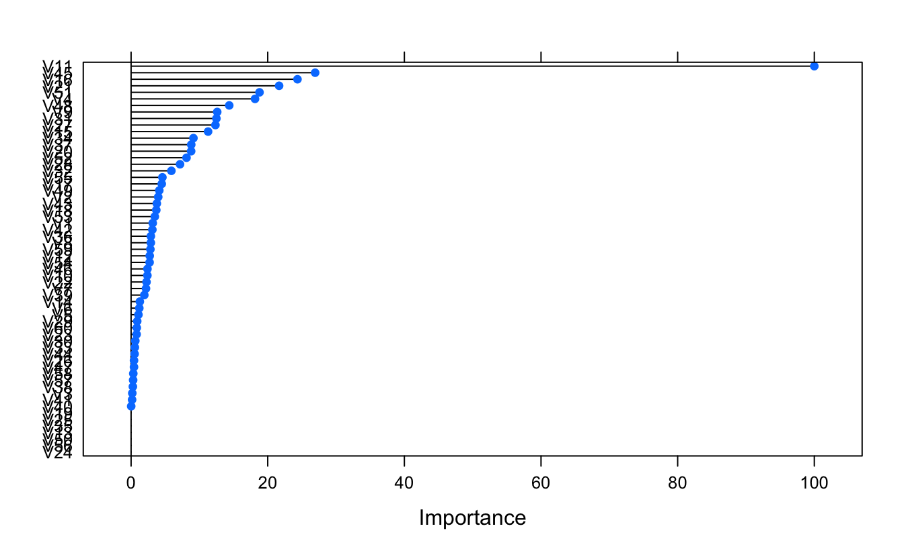
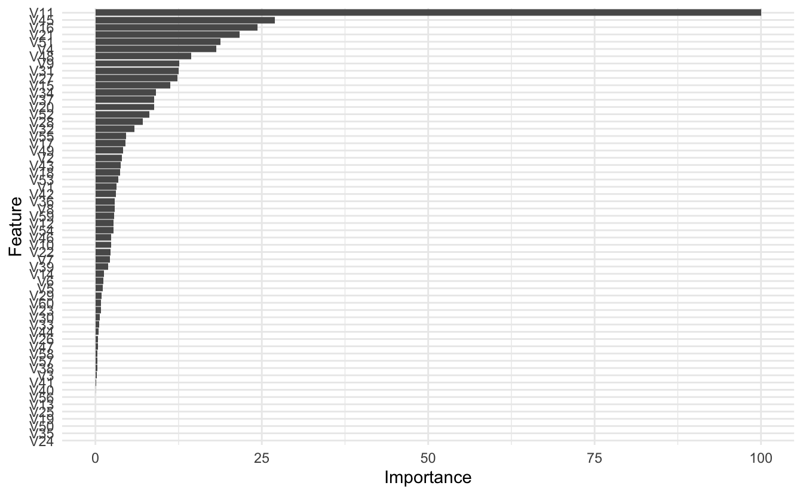
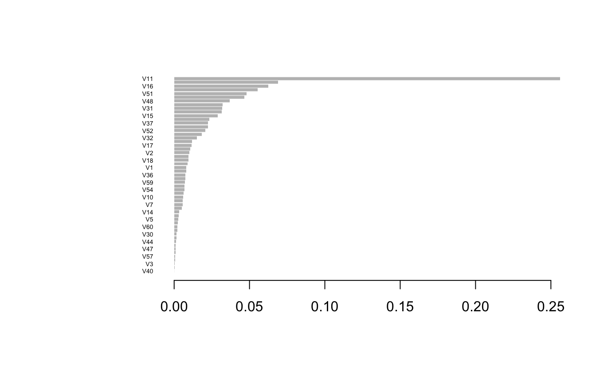

This post will go over extracting feature (variable) importance and creating a function for creating a ggplot object for it. I will draw on the simplicity of Chris Albon's post. For steps to do the following in Python, I recommend his [post](https://chrisalbon.com/machine_learning/trees_and_forests/feature_importance/).

If you've ever created a decision tree, you've probably looked at measures of feature importance. In the above flashcard, impurity refers to how many times a feature was use and lead to a misclassification. Here, we're looking at the importance of a feature, so how much it helped in the classification or prediction of an outcome.

This example will draw on the build in data `Sonar` from the `mlbench` package.

### Prepping the Environment

<pre class='chroma'><code class='language-r' data-lang='r'><a href='https://rdrr.io/r/base/library.html'>library</a>(<a href='https://github.com/topepo/caret/'>caret</a>)
<a href='https://rdrr.io/r/base/library.html'>library</a>(<a href='https://github.com/dmlc/xgboost'>xgboost</a>)
<a href='https://rdrr.io/r/base/library.html'>library</a>(<a href='https://tidyverse.tidyverse.org'>tidyverse</a>)</code></pre>

### Loading the data

<pre class='chroma'><code class='language-r' data-lang='r'><a href='https://rdrr.io/r/utils/data.html'>data</a>("Sonar", package = "mlbench")</code></pre>

### Train the decision tree

<pre class='chroma'><code class='language-r' data-lang='r'>xgb_fit &lt;- <a href='https://rdrr.io/pkg/caret/man/train.html'>train</a>(Class ~ .,
                 data = Sonar,
                 method = "xgbLinear")
</code></pre>

<pre class='chroma'><code class='language-r' data-lang='r'>xgb_fit
#&gt; eXtreme Gradient Boosting 
#&gt; 
#&gt; 208 samples
#&gt;  60 predictor
#&gt;   2 classes: 'M', 'R' 
#&gt; 
#&gt; No pre-processing
#&gt; Resampling: Bootstrapped (25 reps) 
#&gt; Summary of sample sizes: 208, 208, 208, 208, 208, 208, ... 
#&gt; Resampling results across tuning parameters:
#&gt; 
#&gt;   lambda  alpha  nrounds  Accuracy   Kappa    
#&gt;   0e+00   0e+00   50      0.7954411  0.5856736
#&gt;   0e+00   0e+00  100      0.7955067  0.5859968
#&gt;   0e+00   0e+00  150      0.7955067  0.5859968
#&gt;   0e+00   1e-04   50      0.7931161  0.5807902
#&gt;   0e+00   1e-04  100      0.7896880  0.5736899
#&gt;   0e+00   1e-04  150      0.7896880  0.5736899
#&gt;   0e+00   1e-01   50      0.7974045  0.5899654
#&gt;   0e+00   1e-01  100      0.8007978  0.5965433
#&gt;   0e+00   1e-01  150      0.8018652  0.5987027
#&gt;   1e-04   0e+00   50      0.7936100  0.5817500
#&gt;   1e-04   0e+00  100      0.7902008  0.5746993
#&gt;   1e-04   0e+00  150      0.7902008  0.5746993
#&gt;   1e-04   1e-04   50      0.7916874  0.5777943
#&gt;   1e-04   1e-04  100      0.7883283  0.5708511
#&gt;   1e-04   1e-04  150      0.7883283  0.5708511
#&gt;   1e-04   1e-01   50      0.7974045  0.5899654
#&gt;   1e-04   1e-01  100      0.8007978  0.5965433
#&gt;   1e-04   1e-01  150      0.8018652  0.5987027
#&gt;   1e-01   0e+00   50      0.7937810  0.5824365
#&gt;   1e-01   0e+00  100      0.7958099  0.5863334
#&gt;   1e-01   0e+00  150      0.7958099  0.5863334
#&gt;   1e-01   1e-04   50      0.7953707  0.5854209
#&gt;   1e-01   1e-04  100      0.7963228  0.5873658
#&gt;   1e-01   1e-04  150      0.7963228  0.5873658
#&gt;   1e-01   1e-01   50      0.7987849  0.5923712
#&gt;   1e-01   1e-01  100      0.8034709  0.6018293
#&gt;   1e-01   1e-01  150      0.8049729  0.6047501
#&gt; 
#&gt; Tuning parameter 'eta' was held constant at a value of 0.3
#&gt; Accuracy was used to select the optimal model using the largest value.
#&gt; The final values used for the model were nrounds = 150, lambda = 0.1, alpha = 0.1
#&gt;  and eta = 0.3.</code></pre>

### Extract feature importance

Since we are using the `caret` package we can use the built in function to extract feature importance, or the function from the `xgboost` package. We will do both.

#### `caret` feature importance

<pre class='chroma'><code class='language-r' data-lang='r'>caret_imp &lt;- <a href='https://rdrr.io/pkg/caret/man/varImp.html'>varImp</a>(xgb_fit)
#&gt; Warning in value[[3L]](cond): The model had been generated by XGBoost version 1.0.0 or earlier and was loaded from a RDS file. We strongly ADVISE AGAINST using saveRDS() function, to ensure that your model can be read in current and upcoming XGBoost releases. Please use xgb.save() instead to preserve models for the long term. For more details and explanation, see https://xgboost.readthedocs.io/en/latest/tutorials/saving_model.html
#&gt; [16:44:09] WARNING: amalgamation/../src/learner.cc:940: Loading model from XGBoost &lt; 1.0.0, consider saving it again for improved compatibility
caret_imp
#&gt; xgbLinear variable importance
#&gt; 
#&gt;   only 20 most important variables shown (out of 60)
#&gt; 
#&gt;     Overall
#&gt; V11 100.000
#&gt; V45  26.941
#&gt; V16  24.354
#&gt; V21  21.665
#&gt; V51  18.798
#&gt; V4   18.140
#&gt; V48  14.366
#&gt; V9   12.607
#&gt; V31  12.489
#&gt; V27  12.347
#&gt; V15  11.269
#&gt; V34   9.125
#&gt; V37   8.805
#&gt; V20   8.792
#&gt; V52   8.114
#&gt; V28   7.162
#&gt; V32   5.897
#&gt; V55   4.584
#&gt; V17   4.490
#&gt; V49   4.129</code></pre>

#### `xgboost` feature importance

<pre class='chroma'><code class='language-r' data-lang='r'>xgb_imp &lt;- <a href='https://rdrr.io/pkg/xgboost/man/xgb.importance.html'>xgb.importance</a>(feature_names = xgb_fit$finalModel$feature_names,
               model = xgb_fit$finalModel)

<a href='https://rdrr.io/r/utils/head.html'>head</a>(xgb_imp)
#&gt;    Feature       Gain      Cover  Frequency
#&gt; 1:     V11 0.25619825 0.12851518 0.03283582
#&gt; 2:     V45 0.06902206 0.04458378 0.03582090
#&gt; 3:     V16 0.06239349 0.04163116 0.01492537
#&gt; 4:     V21 0.05550596 0.03471532 0.02686567
#&gt; 5:     V51 0.04816044 0.04527491 0.05373134
#&gt; 6:      V4 0.04647539 0.03484924 0.03880597</code></pre>

### Plotting feature importance

#### caret

You have a few options when it comes to plotting feature importance. You can call plot on the saved object from caret as follows:

<pre class='chroma'><code class='language-r' data-lang='r'><a href='https://r-spatial.github.io/sf/reference/plot.html'>plot</a>(caret_imp)
</code></pre>

<pre class='chroma'><code class='language-r' data-lang='r'><a href='https://ggplot2.tidyverse.org/reference/ggplot.html'>ggplot</a>(caret_imp) +
  <a href='https://ggplot2.tidyverse.org/reference/ggtheme.html'>theme_minimal</a>()
</code></pre>

#### `xgboost`

You can use the plot functionality from `xgboost`

<pre class='chroma'><code class='language-r' data-lang='r'><a href='https://rdrr.io/pkg/xgboost/man/xgb.plot.importance.html'>xgb.plot.importance</a>(xgb_imp)
</code></pre>

Or use their ggplot feature

<pre class='chroma'><code class='language-r' data-lang='r'><a href='https://rdrr.io/pkg/xgboost/man/xgb.plot.importance.html'>xgb.ggplot.importance</a>(xgb_imp)</code></pre>

