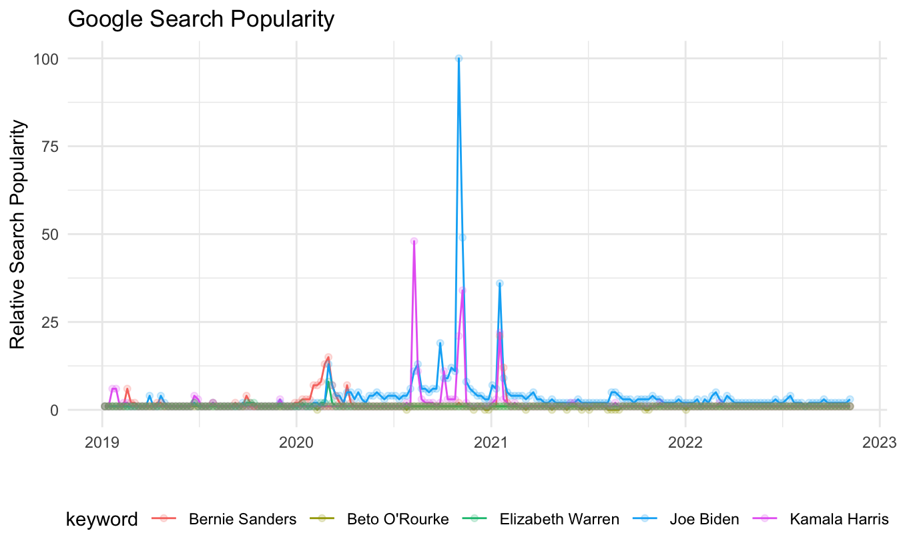

`trendyy` is a package for querying Google Trends. It is build around [Philippe Massicotte](https://github.com/PMassicotte)'s package [`gtrendsR`](https://github.com/PMassicotte/gtrendsR) which accesses this data wonderfully.

The inspiration for this package was to provide a tidy interface to the trends data.

## Getting Started

### Installation

You can install `trendyy` from CRAN using `install.packages("trendyy")`.

### Usage

Use [`trendy()`](https://rdrr.io/pkg/trendyy/man/trendy.html) to search Google Trends. The only mandatory argument is `search_terms`. This is a character vector with the terms of interest. It is important to note that Google Trends is only capable of comparing up to five terms. Thus, if your `search_terms` vector is longer than 5, it will search each term individually. This will remove the direct comparative advantage that Google Trends gives you.

#### Additional arguments

-   `from`: The beginning date of the query in `"YYYY-MM-DD"` format.
-   `to`: The end date of the query in `"YYYY-MM-DD"` format.
-   `...` : any additional arguments that would be passed to [`gtrendsR::gtrends()`](https://rdrr.io/pkg/gtrendsR/man/gtrends.html). Note that it might be useful to indicate the geography of interest. See [`gtrendsR::countries`](https://rdrr.io/pkg/gtrendsR/man/countries.html) for list of possible geographies.

#### Accessor Functions

-   [`get_interest()`](https://rdrr.io/pkg/trendyy/man/get_interest.html): Retrieve interest over time
-   [`get_interest_city()`](https://rdrr.io/pkg/trendyy/man/get_interest_city.html): Retrieve interest by city
-   [`get_interest_country()`](https://rdrr.io/pkg/trendyy/man/get_interest_country.html): Retrieve interest by country
-   [`get_interest_dma()`](https://rdrr.io/pkg/trendyy/man/get_interest_dma.html): Retrieve interest by DMA
-   [`get_interest_region()`](https://rdrr.io/pkg/trendyy/man/get_interest_region.html): Retrieve interest by region
-   [`get_related_queries()`](https://rdrr.io/pkg/trendyy/man/get_related_queries.html): Retrieve related queries
-   [`get_related_topics()`](https://rdrr.io/pkg/trendyy/man/get_related_topics.html): Retrieve related topics

## Example

Seeing as I found an interest in this due to the relatively pervasive use of Google Trends in political analysis, I will compare the top five polling candidates in the 2020 Democratic Primary. As of May 22nd, they were Joe Biden, Kamala Harris, Beto O'Rourke, Bernie Sanders, and Elizabeth Warren.

First, I will create a vector of my desired search terms. Second, I will pass that vector to [`trendy()`](https://rdrr.io/pkg/trendyy/man/trendy.html) specifying my query date range from the first of 2019 until today (May 25th, 2019).

<pre class='chroma'><code class='language-r' data-lang='r'>candidates &lt;- <a href='https://rdrr.io/r/base/c.html'>c</a>("Joe Biden", "Kamala Harris", "Beto O'Rourke", "Bernie Sanders", "Elizabeth Warren")

candidate_trends &lt;- <a href='https://rdrr.io/pkg/trendyy/man/trendy.html'>trendy</a>(candidates, from = "2019-01-01", to = <a href='https://rdrr.io/r/base/Sys.time.html'>Sys.Date</a>())</code></pre>

Now that we have a trendy object, we can print it out to get a summary of the trends.

<pre class='chroma'><code class='language-r' data-lang='r'>candidate_trends
#&gt; ~Trendy results~
#&gt; 
#&gt; Search Terms: Joe Biden, Kamala Harris, Beto O'Rourke, Bernie Sanders, Elizabeth Warren
#&gt; 
#&gt; (&gt;^.^)&gt; ~~~~~~~~~~~~~~~~~~~~ summary ~~~~~~~~~~~~~~~~~~~~ &lt;(^.^&lt;)
#&gt; # A tibble: 5 × 5
#&gt;   keyword          max_hits min_hits from       to        
#&gt;   &lt;chr&gt;               &lt;int&gt;    &lt;int&gt; &lt;date&gt;     &lt;date&gt;    
#&gt; 1 Bernie Sanders         21        1 2019-01-06 2022-11-06
#&gt; 2 Beto O'Rourke           1        0 2019-01-06 2022-11-06
#&gt; 3 Elizabeth Warren        8        1 2019-01-06 2022-11-06
#&gt; 4 Joe Biden             100        1 2019-01-06 2022-11-06
#&gt; 5 Kamala Harris          48        1 2019-01-06 2022-11-06</code></pre>

In order to retrieve the trend data, use [`get_interest()`](https://rdrr.io/pkg/trendyy/man/get_interest.html). Note, that this is dplyr friendly.

<pre class='chroma'><code class='language-r' data-lang='r'><a href='https://rdrr.io/pkg/trendyy/man/get_interest.html'>get_interest</a>(candidate_trends)
#&gt; # A tibble: 1,005 × 7
#&gt;    date                 hits keyword   geo   time                  gprop category      
#&gt;    &lt;dttm&gt;              &lt;int&gt; &lt;chr&gt;     &lt;chr&gt; &lt;chr&gt;                 &lt;chr&gt; &lt;chr&gt;         
#&gt;  1 2019-01-06 00:00:00     1 Joe Biden world 2019-01-01 2022-11-14 web   All categories
#&gt;  2 2019-01-13 00:00:00     1 Joe Biden world 2019-01-01 2022-11-14 web   All categories
#&gt;  3 2019-01-20 00:00:00     1 Joe Biden world 2019-01-01 2022-11-14 web   All categories
#&gt;  4 2019-01-27 00:00:00     1 Joe Biden world 2019-01-01 2022-11-14 web   All categories
#&gt;  5 2019-02-03 00:00:00     1 Joe Biden world 2019-01-01 2022-11-14 web   All categories
#&gt;  6 2019-02-10 00:00:00     1 Joe Biden world 2019-01-01 2022-11-14 web   All categories
#&gt;  7 2019-02-17 00:00:00     1 Joe Biden world 2019-01-01 2022-11-14 web   All categories
#&gt;  8 2019-02-24 00:00:00     1 Joe Biden world 2019-01-01 2022-11-14 web   All categories
#&gt;  9 2019-03-03 00:00:00     1 Joe Biden world 2019-01-01 2022-11-14 web   All categories
#&gt; 10 2019-03-10 00:00:00     1 Joe Biden world 2019-01-01 2022-11-14 web   All categories
#&gt; # … with 995 more rows
#&gt; # ℹ Use `print(n = ...)` to see more rows</code></pre>

### Plotting Interest

<pre class='chroma'><code class='language-r' data-lang='r'>candidate_trends <a href='https://magrittr.tidyverse.org/reference/pipe.html'>%&gt;%</a> 
  <a href='https://rdrr.io/pkg/trendyy/man/get_interest.html'>get_interest</a>() <a href='https://magrittr.tidyverse.org/reference/pipe.html'>%&gt;%</a> 
  <a href='https://ggplot2.tidyverse.org/reference/ggplot.html'>ggplot</a>(<a href='https://ggplot2.tidyverse.org/reference/aes.html'>aes</a>(date, hits, color = keyword)) +
  <a href='https://ggplot2.tidyverse.org/reference/geom_path.html'>geom_line</a>() +
  <a href='https://ggplot2.tidyverse.org/reference/geom_point.html'>geom_point</a>(alpha = .2) +
  <a href='https://ggplot2.tidyverse.org/reference/ggtheme.html'>theme_minimal</a>() +
  <a href='https://ggplot2.tidyverse.org/reference/theme.html'>theme</a>(legend.position = "bottom") +
  <a href='https://ggplot2.tidyverse.org/reference/labs.html'>labs</a>(x = "", 
       y = "Relative Search Popularity",
       title = "Google Search Popularity")
</code></pre>

It is also possible to view the related search queries for a given set of keywords using [`get_related_queries()`](https://rdrr.io/pkg/trendyy/man/get_related_queries.html).

<pre class='chroma'><code class='language-r' data-lang='r'>candidate_trends <a href='https://magrittr.tidyverse.org/reference/pipe.html'>%&gt;%</a> 
  <a href='https://rdrr.io/pkg/trendyy/man/get_related_queries.html'>get_related_queries</a>() <a href='https://magrittr.tidyverse.org/reference/pipe.html'>%&gt;%</a> 
  <a href='https://dplyr.tidyverse.org/reference/group_by.html'>group_by</a>(keyword) <a href='https://magrittr.tidyverse.org/reference/pipe.html'>%&gt;%</a> 
  <a href='https://dplyr.tidyverse.org/reference/sample_n.html'>sample_n</a>(2)
#&gt; # A tibble: 10 × 5
#&gt; # Groups:   keyword [5]
#&gt;    subject  related_queries value                        keyword          category      
#&gt;    &lt;chr&gt;    &lt;chr&gt;           &lt;chr&gt;                        &lt;chr&gt;            &lt;chr&gt;         
#&gt;  1 +3,450%  rising          klobuchar                    Bernie Sanders   All categories
#&gt;  2 81       top             joe biden                    Bernie Sanders   All categories
#&gt;  3 32       top             kamala harris                Beto ORourke     All categories
#&gt;  4 Breakout rising          beto orourke announcement    Beto ORourke     All categories
#&gt;  5 Breakout rising          elizabeth warren beer video  Elizabeth Warren All categories
#&gt;  6 40       top             elizabeth warren net worth   Elizabeth Warren All categories
#&gt;  7 Breakout rising          joe biden stimulus           Joe Biden        All categories
#&gt;  8 Breakout rising          joe biden senile             Joe Biden        All categories
#&gt;  9 Breakout rising          kamala harris husbands       Kamala Harris    All categories
#&gt; 10 30       top             vice president kamala harris Kamala Harris    All categories</code></pre>

### Useful Resources

-   [How Trends Data Is Adjusted](https://support.google.com/trends/answer/4365533?hl=en)
-   [Post by Google News Lab](https://medium.com/google-news-lab/what-is-google-trends-data-and-what-does-it-mean-b48f07342ee8)

