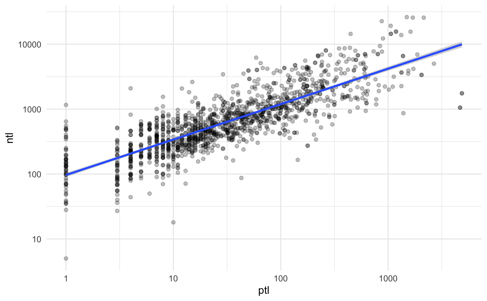

Over the past few years we have seen Google Trends becoming quite ubiquitous in politics. Pundits have used Google seach trends as talking points. It is not uncommon to hear news about a candidates search trends the days following a town hall or significant rally. It seems that Google trends are becoming the go to proxy for a candidate's salience.

As a campaign, you are interested in the popularity of a candidate *relative* to another one. If candidate A has seen a gain from 50 to 70, that is all well and good. But how does that compare with candidates C and D? There are others potential use cases---that may be less fraught with media interruptions. For example, one can keep track of the popularity of possible policy issues---i.e. healthcare, gun safety, women's rights.

Though the usefulness of Google Trends search popularity is still unclear, it may be something that your campaign might like to track. In this chapter we will explore how to acquire and utilize trend data using R. This chapter will describe how one can utilize Google Trends data to compare candidate search popularity and view related search terms. This will be done with the tidyverse, and the package `trendyy` for accessing this data.

## Google Trends Data

### Relative Popularity

The key metric that Google Trends provides is the *relative* popularity of a search term by a given geography. Relative search popularity is scaled from 0 to 100. This number is scaled based on population and geography size (for more information go [here](https://support.google.com/trends/answer/4365533?hl=en)). This number may be useful on it's own, but the strength of Google Trends is it's ability to compare multiple terms. Using Google Trends we can compare up to 5 search terms---presumably candidates.

### Related Queries

In addition to popularity, Google Trends provides you with related queries. This can help your media team understand in what context their candidate is being associated online.

## `trendyy`

Now that we have an intuition of how Google Trends may be utilized, we will look at how actually acquire these data in R. To get started install the package using `install.packages("trendyy")`.

Once the package is installed, load the `tidyverse` and `trendyy`.

<pre class='chroma'><code class='language-r' data-lang='r'><a href='https://rdrr.io/r/base/library.html'>library</a>(<a href='https://github.com/josiahparry/trendyy'>trendyy</a>)
<a href='https://rdrr.io/r/base/library.html'>library</a>(<a href='https://tidyverse.tidyverse.org'>tidyverse</a>)</code></pre>

In this example we will look at the top five polling candidates as of today (6/10/2019). These are, in no particular order, Joe Biden, Kamala Harris, Beto O'Rourke, Bernie Sanders, and Elizabeth Warren. Create a vector with the search terms that you will use (in this case the above candidates).

<pre class='chroma'><code class='language-r' data-lang='r'>candidates &lt;- <a href='https://rdrr.io/r/base/c.html'>c</a>("Joe Biden", "Kamala Harris", "Beto O'Rourke", "Bernie Sanders", "Elizabeth Warren")</code></pre>

Next we will use the `trendyy` package to get search popularity. The function [`trendy()`](https://rdrr.io/pkg/trendyy/man/trendy.html) has three main arguments: `search_terms`, `from`, and `to` (in the form of `"yyyy-mm-dd"`). The first argument is the only mandatory one. Provide a vector of length 5 or less as the first argument. Here we will use the `candidates` vector and look at data from the past two weeks. I will create two variables for the beginning and end dates. This will be to demonstrate how functions can be used to programatically search date ranges.

<pre class='chroma'><code class='language-r' data-lang='r'># to today
end &lt;- <a href='https://rdrr.io/r/base/Sys.time.html'>Sys.Date</a>()
# from 2 weeks ago
begin &lt;- <a href='https://rdrr.io/r/base/Sys.time.html'>Sys.Date</a>() - 14</code></pre>

Pass these arguments to [`trendy()`](https://rdrr.io/pkg/trendyy/man/trendy.html) and save them to a variable.

<pre class='chroma'><code class='language-r' data-lang='r'>candidate_trends &lt;- <a href='https://rdrr.io/pkg/trendyy/man/trendy.html'>trendy</a>(search_terms = candidates, from = begin, to = end)

candidate_trends
#&gt; ~Trendy results~
#&gt; 
#&gt; Search Terms: Joe Biden, Kamala Harris, Beto O'Rourke, Bernie Sanders, Elizabeth Warren
#&gt; 
#&gt; (&gt;^.^)&gt; ~~~~~~~~~~~~~~~~~~~~ summary ~~~~~~~~~~~~~~~~~~~~ &lt;(^.^&lt;)
#&gt; # A tibble: 5 × 5
#&gt;   keyword          max_hits min_hits from       to        
#&gt;   &lt;chr&gt;               &lt;int&gt;    &lt;int&gt; &lt;date&gt;     &lt;date&gt;    
#&gt; 1 Bernie Sanders         12        4 2022-10-31 2022-11-10
#&gt; 2 Beto O'Rourke           6        1 2022-10-31 2022-11-10
#&gt; 3 Elizabeth Warren        3        1 2022-10-31 2022-11-10
#&gt; 4 Joe Biden             100       42 2022-10-31 2022-11-10
#&gt; 5 Kamala Harris          10        5 2022-10-31 2022-11-10</code></pre>

Trendy creates an object of class `trendy` see `class(candidate_trends)` trendy. There are a number of accessor functions. We will use [`get_interest()`](https://rdrr.io/pkg/trendyy/man/get_interest.html) and [`get_related_queries()`](https://rdrr.io/pkg/trendyy/man/get_related_queries.html). See the documentation of the others.

To access to relative popularity, we will use `get_interest(trendy)`.

<pre class='chroma'><code class='language-r' data-lang='r'>popularity &lt;- <a href='https://rdrr.io/pkg/trendyy/man/get_interest.html'>get_interest</a>(candidate_trends)

popularity
#&gt; # A tibble: 55 × 7
#&gt;    date                 hits keyword   geo   time                  gprop category      
#&gt;    &lt;dttm&gt;              &lt;int&gt; &lt;chr&gt;     &lt;chr&gt; &lt;chr&gt;                 &lt;chr&gt; &lt;chr&gt;         
#&gt;  1 2022-10-31 00:00:00    48 Joe Biden world 2022-10-31 2022-11-14 web   All categories
#&gt;  2 2022-11-01 00:00:00    42 Joe Biden world 2022-10-31 2022-11-14 web   All categories
#&gt;  3 2022-11-02 00:00:00    51 Joe Biden world 2022-10-31 2022-11-14 web   All categories
#&gt;  4 2022-11-03 00:00:00    52 Joe Biden world 2022-10-31 2022-11-14 web   All categories
#&gt;  5 2022-11-04 00:00:00    47 Joe Biden world 2022-10-31 2022-11-14 web   All categories
#&gt;  6 2022-11-05 00:00:00    45 Joe Biden world 2022-10-31 2022-11-14 web   All categories
#&gt;  7 2022-11-06 00:00:00    46 Joe Biden world 2022-10-31 2022-11-14 web   All categories
#&gt;  8 2022-11-07 00:00:00    52 Joe Biden world 2022-10-31 2022-11-14 web   All categories
#&gt;  9 2022-11-08 00:00:00    67 Joe Biden world 2022-10-31 2022-11-14 web   All categories
#&gt; 10 2022-11-09 00:00:00   100 Joe Biden world 2022-10-31 2022-11-14 web   All categories
#&gt; # … with 45 more rows
#&gt; # ℹ Use `print(n = ...)` to see more rows</code></pre>

For related queries we will use `get_related_queries(trendy)`. Note that you can either pipe the object or pass it directly.

<pre class='chroma'><code class='language-r' data-lang='r'>candidate_trends <a href='https://magrittr.tidyverse.org/reference/pipe.html'>%&gt;%</a> 
  <a href='https://rdrr.io/pkg/trendyy/man/get_related_queries.html'>get_related_queries</a>() <a href='https://magrittr.tidyverse.org/reference/pipe.html'>%&gt;%</a> 
  # picking queries for a random candidate
  <a href='https://dplyr.tidyverse.org/reference/filter.html'>filter</a>(keyword == <a href='https://rdrr.io/r/base/sample.html'>sample</a>(candidates, 1))
#&gt; # A tibble: 42 × 5
#&gt;    subject related_queries value                    keyword        category      
#&gt;    &lt;chr&gt;   &lt;chr&gt;           &lt;chr&gt;                    &lt;chr&gt;          &lt;chr&gt;         
#&gt;  1 100     top             election                 Bernie Sanders All categories
#&gt;  2 68      top             big mouth bernie sanders Bernie Sanders All categories
#&gt;  3 61      top             biden                    Bernie Sanders All categories
#&gt;  4 56      top             election results         Bernie Sanders All categories
#&gt;  5 47      top             bernie sanders meme      Bernie Sanders All categories
#&gt;  6 37      top             bernie sanders party     Bernie Sanders All categories
#&gt;  7 33      top             bernie sanders age       Bernie Sanders All categories
#&gt;  8 33      top             joe biden                Bernie Sanders All categories
#&gt;  9 33      top             trump                    Bernie Sanders All categories
#&gt; 10 30      top             donald trump             Bernie Sanders All categories
#&gt; # … with 32 more rows
#&gt; # ℹ Use `print(n = ...)` to see more rows</code></pre>

## Visualizing Trends

I'm guessing your director enjoys charts---so do I. To make the data more accessible, use the `popularity` tibble to create a time series chart of popularity over the past two weeks. We will use `ggplot2`. Remember that time should be displayed on the x axis. We want to have a line for each candidate, so map the color aesthetic to the keyword.

<pre class='chroma'><code class='language-r' data-lang='r'><a href='https://ggplot2.tidyverse.org/reference/ggplot.html'>ggplot</a>(popularity, 
       <a href='https://ggplot2.tidyverse.org/reference/aes.html'>aes</a>(x = date, y = hits, color = keyword)) + 
  <a href='https://ggplot2.tidyverse.org/reference/geom_path.html'>geom_line</a>() +
  <a href='https://ggplot2.tidyverse.org/reference/labs.html'>labs</a>(x = "", y = "Search Popularity", 
       title = "Google popularity of top 5 polling candidates") + 
  <a href='https://ggplot2.tidyverse.org/reference/ggtheme.html'>theme_minimal</a>() +
  <a href='https://ggplot2.tidyverse.org/reference/theme.html'>theme</a>(legend.position = "bottom", 
        legend.title = <a href='https://ggplot2.tidyverse.org/reference/element.html'>element_blank</a>())
</code></pre>

