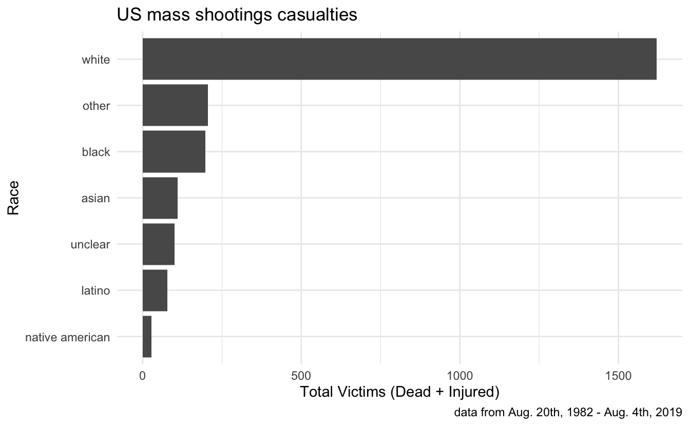
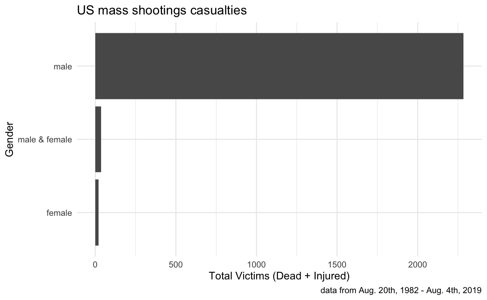

<pre class='chroma'><code class='language-r' data-lang='r'><a href='https://rdrr.io/r/base/library.html'>library</a>(<a href='https://tidyverse.tidyverse.org'>tidyverse</a>)

terrorists &lt;- readr::<a href='https://readr.tidyverse.org/reference/read_delim.html'>read_csv</a>("https://docs.google.com/spreadsheets/d/e/2PACX-1vSqNhpFX_69klKgJCVobc3fjHYVE9pNosrDi9h6irLlCtSSLpR704iu9VqI7CxdRi0iKt3p1FDYbu8Y/pub?gid=956062857&amp;single=true&amp;output=csv")</code></pre>

<pre class='chroma'><code class='language-r' data-lang='r'>terrorist_by_race
#&gt; # A tibble: 7 × 6
#&gt;   race                n fatalities injured total_victims   `%`
#&gt;   &lt;chr&gt;           &lt;int&gt;      &lt;dbl&gt;   &lt;dbl&gt;         &lt;dbl&gt; &lt;dbl&gt;
#&gt; 1 white              63        554    1067          1621 69.3 
#&gt; 2 other               5         90     115           205  8.77
#&gt; 3 black              19        108      89           197  8.43
#&gt; 4 asian               8         77      33           110  4.70
#&gt; 5 unclear             6         40      61           101  4.32
#&gt; 6 latino             10         44      33            77  3.29
#&gt; 7 native american     3         19       8            27  1.15</code></pre>

<pre class='chroma'><code class='language-r' data-lang='r'>terrorist_by_gender
#&gt; # A tibble: 3 × 6
#&gt;   gender            n fatalities injured total_victims    `%`
#&gt;   &lt;chr&gt;         &lt;int&gt;      &lt;dbl&gt;   &lt;dbl&gt;         &lt;dbl&gt;  &lt;dbl&gt;
#&gt; 1 male            110        903    1380          2283 97.6  
#&gt; 2 male &amp; female     1         14      21            35  1.50 
#&gt; 3 female            3         15       5            20  0.855</code></pre>

<pre class='chroma'><code class='language-r' data-lang='r'>terrorist &lt;- <a href='https://rdrr.io/r/base/c.html'>c</a>("angry", "white", "male")
my_parts &lt;- <a href='https://rdrr.io/r/base/c.html'>c</a>("angry", "white", "male")</code></pre>

<pre class='chroma'><code class='language-r' data-lang='r'>my_parts == terrorist
#&gt; [1] TRUE TRUE TRUE</code></pre>

<pre class='chroma'><code class='language-r' data-lang='r'>`I am` &gt; <a href='https://rdrr.io/r/base/sum.html'>sum</a>(my_parts)</code></pre>

<pre class='chroma'><code class='language-r' data-lang='r'>#&gt; [1] TRUE</code></pre>

<pre class='chroma'><code class='language-r' data-lang='r'>`I am` == <a href='https://rdrr.io/r/base/sum.html'>sum</a>(terrorist)</code></pre>

<pre class='chroma'><code class='language-r' data-lang='r'>FALSE
#&gt; [1] FALSE</code></pre>

<pre class='chroma'><code class='language-r' data-lang='r'>white_males &lt;- <a href='https://dplyr.tidyverse.org/reference/filter.html'>filter</a>(terrorists,
                      race == "white",
                      <a href='https://rdrr.io/r/base/chartr.html'>tolower</a>(gender) == "male",
                      !<a href='https://rdrr.io/r/base/NA.html'>is.na</a>(name))

<a href='https://dplyr.tidyverse.org/reference/pull.html'>pull</a>(white_males, name)
#&gt;  [1] "Jordan Witmer"             "Zephen A. Xaver"           "Robert D. Bowers"         
#&gt;  [4] "Jarrod W. Ramos"           "Dimitrios Pagourtzis"      "Travis Reinking"          
#&gt;  [7] "Nikolas J. Cruz"           "Timothy O'Brien Smith"     "Kevin Janson Neal"        
#&gt; [10] "Devin Patrick Kelley"      "Scott Allen Ostrem"        "Stephen Craig Paddock"    
#&gt; [13] "Randy Stair"               "Thomas Hartless"           "Jason B. Dalton"          
#&gt; [16] "Robert Lewis Dear"         "Noah Harpham"              "Dylann Storm Roof"        
#&gt; [19] "Elliot Rodger"             "John Zawahri"              "Kurt Myers"               
#&gt; [22] "Adam Lanza"                "Andrew Engeldinger"        "Wade Michael Page"        
#&gt; [25] "James Holmes"              "Ian Stawicki"              "Scott Evans Dekraai"      
#&gt; [28] "Jared Loughner"            "Robert Stewart"            "Wesley Neal Higdon"       
#&gt; [31] "Steven Kazmierczak"        "Robert A. Hawkins"         "Tyler Peterson"           
#&gt; [34] "Sulejman Talović\u0087"    "Charles Carl Roberts"      "Kyle Aaron Huff"          
#&gt; [37] "Terry Michael Ratzmann"    "Nathan Gale"               "Douglas Williams"         
#&gt; [40] "Michael McDermott"         "Larry Gene Ashbrook"       "Day trader Mark O. Barton"
#&gt; [43] "Eric Harris"               "Kipland P. Kinkel"         "Mitchell Scott Johnson"   
#&gt; [46] "Matthew Beck"              "Dean Allen Mellberg"       "Kenneth Junior French"    
#&gt; [49] "Gian Luigi Ferri"          "John T. Miller"            "Eric Houston"             
#&gt; [52] "Thomas McIlvane"           "George Hennard"            "Joseph T. Wesbecker"      
#&gt; [55] "Patrick Purdy"             "Richard Farley"            "William Cruse"            
#&gt; [58] "Patrick Sherrill"          "James Oliver Huberty"      "Abdelkrim Belachheb"      
#&gt; [61] "Carl Robert Brown"</code></pre>

<pre class='chroma'><code class='language-r' data-lang='r'>am_i &lt;- function(terrorist) &#123;
  msg &lt;- <a href='https://rdrr.io/r/base/paste.html'>paste</a>("am i ==", terrorist)
  <a href='https://rdrr.io/r/base/print.html'>print</a>(msg)
  <a href='https://rdrr.io/r/base/print.html'>print</a>(`am i` == terrorist)
&#125;</code></pre>

<pre class='chroma'><code class='language-r' data-lang='r'><a href='https://dplyr.tidyverse.org/reference/pull.html'>pull</a>(white_males, name) <a href='https://magrittr.tidyverse.org/reference/pipe.html'>%&gt;%</a> 
  <a href='https://purrr.tidyverse.org/reference/map.html'>walk</a>(~am_i(.))
#&gt; [1] "`am i` == Jordan Witmer"
#&gt; [1] FALSE
#&gt; [1] "`am i` == Zephen A. Xaver"
#&gt; [1] FALSE
#&gt; [1] "`am i` == Robert D. Bowers"
#&gt; [1] FALSE
#&gt; [1] "`am i` == Jarrod W. Ramos"
#&gt; [1] FALSE
#&gt; [1] "`am i` == Dimitrios Pagourtzis"
#&gt; [1] FALSE
#&gt; [1] "`am i` == Travis Reinking"
#&gt; [1] FALSE
#&gt; [1] "`am i` == Nikolas J. Cruz"
#&gt; [1] FALSE
#&gt; [1] "`am i` == Timothy O'Brien Smith"
#&gt; [1] FALSE
#&gt; [1] "`am i` == Kevin Janson Neal"
#&gt; [1] FALSE
#&gt; [1] "`am i` == Devin Patrick Kelley"
#&gt; [1] FALSE
#&gt; [1] "`am i` == Scott Allen Ostrem"
#&gt; [1] FALSE
#&gt; [1] "`am i` == Stephen Craig Paddock"
#&gt; [1] FALSE
#&gt; [1] "`am i` == Randy Stair"
#&gt; [1] FALSE
#&gt; [1] "`am i` == Thomas Hartless"
#&gt; [1] FALSE
#&gt; [1] "`am i` == Jason B. Dalton"
#&gt; [1] FALSE
#&gt; [1] "`am i` == Robert Lewis Dear"
#&gt; [1] FALSE
#&gt; [1] "`am i` == Noah Harpham"
#&gt; [1] FALSE
#&gt; [1] "`am i` == Dylann Storm Roof"
#&gt; [1] FALSE
#&gt; [1] "`am i` == Elliot Rodger"
#&gt; [1] FALSE
#&gt; [1] "`am i` == John Zawahri"
#&gt; [1] FALSE
#&gt; [1] "`am i` == Kurt Myers"
#&gt; [1] FALSE
#&gt; [1] "`am i` == Adam Lanza"
#&gt; [1] FALSE
#&gt; [1] "`am i` == Andrew Engeldinger"
#&gt; [1] FALSE
#&gt; [1] "`am i` == Wade Michael Page"
#&gt; [1] FALSE
#&gt; [1] "`am i` == James Holmes"
#&gt; [1] FALSE
#&gt; [1] "`am i` == Ian Stawicki"
#&gt; [1] FALSE
#&gt; [1] "`am i` == Scott Evans Dekraai"
#&gt; [1] FALSE
#&gt; [1] "`am i` == Jared Loughner"
#&gt; [1] FALSE
#&gt; [1] "`am i` == Robert Stewart"
#&gt; [1] FALSE
#&gt; [1] "`am i` == Wesley Neal Higdon"
#&gt; [1] FALSE
#&gt; [1] "`am i` == Steven Kazmierczak"
#&gt; [1] FALSE
#&gt; [1] "`am i` == Robert A. Hawkins"
#&gt; [1] FALSE
#&gt; [1] "`am i` == Tyler Peterson"
#&gt; [1] FALSE
#&gt; [1] "`am i` == Sulejman Talović\u0087"
#&gt; [1] FALSE
#&gt; [1] "`am i` == Charles Carl Roberts"
#&gt; [1] FALSE
#&gt; [1] "`am i` == Kyle Aaron Huff"
#&gt; [1] FALSE
#&gt; [1] "`am i` == Terry Michael Ratzmann"
#&gt; [1] FALSE
#&gt; [1] "`am i` == Nathan Gale"
#&gt; [1] FALSE
#&gt; [1] "`am i` == Douglas Williams"
#&gt; [1] FALSE
#&gt; [1] "`am i` == Michael McDermott"
#&gt; [1] FALSE
#&gt; [1] "`am i` == Larry Gene Ashbrook"
#&gt; [1] FALSE
#&gt; [1] "`am i` == Day trader Mark O. Barton"
#&gt; [1] FALSE
#&gt; [1] "`am i` == Eric Harris"
#&gt; [1] FALSE
#&gt; [1] "`am i` == Kipland P. Kinkel"
#&gt; [1] FALSE
#&gt; [1] "`am i` == Mitchell Scott Johnson"
#&gt; [1] FALSE
#&gt; [1] "`am i` == Matthew Beck"
#&gt; [1] FALSE
#&gt; [1] "`am i` == Dean Allen Mellberg"
#&gt; [1] FALSE
#&gt; [1] "`am i` == Kenneth Junior French"
#&gt; [1] FALSE
#&gt; [1] "`am i` == Gian Luigi Ferri"
#&gt; [1] FALSE
#&gt; [1] "`am i` == John T. Miller"
#&gt; [1] FALSE
#&gt; [1] "`am i` == Eric Houston"
#&gt; [1] FALSE
#&gt; [1] "`am i` == Thomas McIlvane"
#&gt; [1] FALSE
#&gt; [1] "`am i` == George Hennard"
#&gt; [1] FALSE
#&gt; [1] "`am i` == Joseph T. Wesbecker"
#&gt; [1] FALSE
#&gt; [1] "`am i` == Patrick Purdy"
#&gt; [1] FALSE
#&gt; [1] "`am i` == Richard Farley"
#&gt; [1] FALSE
#&gt; [1] "`am i` == William Cruse"
#&gt; [1] FALSE
#&gt; [1] "`am i` == Patrick Sherrill"
#&gt; [1] FALSE
#&gt; [1] "`am i` == James Oliver Huberty"
#&gt; [1] FALSE
#&gt; [1] "`am i` == Abdelkrim Belachheb"
#&gt; [1] FALSE
#&gt; [1] "`am i` == Carl Robert Brown"
#&gt; [1] FALSE</code></pre>

<pre class='chroma'><code class='language-r' data-lang='r'>`I am` &gt; <a href='https://rdrr.io/r/base/sum.html'>sum</a>(my_parts)</code></pre>

