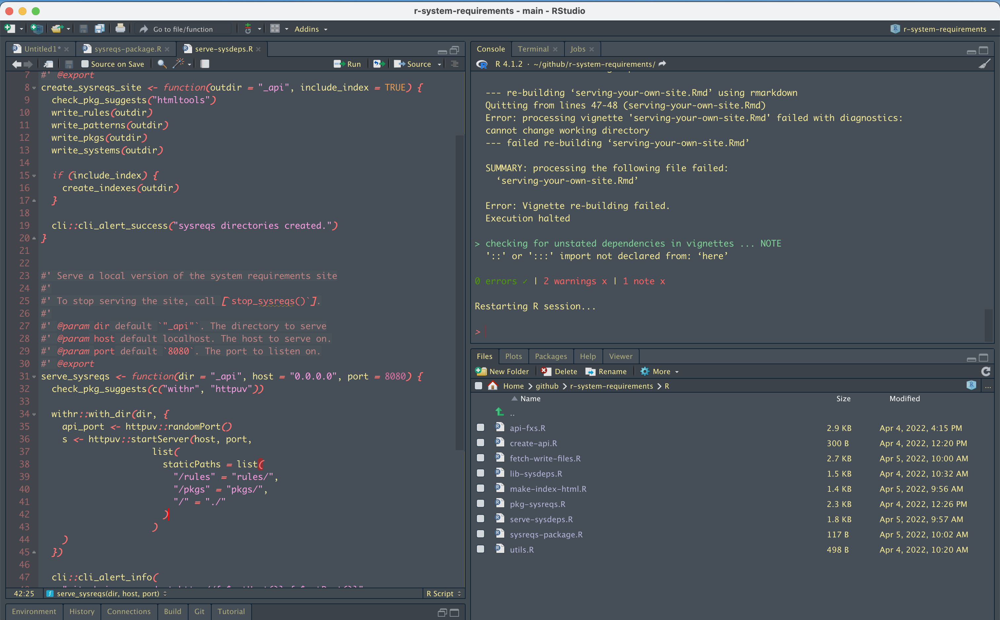

In general, I'm not a fan of "Dark Themes." I find that they have too much contrast and hurt my eyes a bit. However, at night time when the lights are dim, my good ole trusty XCode theme becomes too much and a dark-er theme would be helpful.

I've found that "Material" is nice, but again a bit too dark. I previously had a theme "Keeping Warm" (inspired by the [song of the same name](https://open.spotify.com/track/6kh3x7kpGCUVMBlgz3o17a?si=bf68d782ca46483a)) that was a dim maroon based theme. When I returned my machine to RStudio I forgot to save the theme for myself! So for the past four months I've been needing something to suit my needs.

Over the past two weeks or so I've worked on developing my own theme. I asked my partner what to call it and she quickly came up with "Emo Candy Land"---genius. Naturally, I renamed it `xxEmoCandyLandxx`. It was made with a fork of [`{rsthemes}`](https://github.com/gadenbuie/rsthemes). I felt very strongly that I'd like my functions to be both italicized and bolded which are not supported today. Though it would be a rather straightforward change I'd think.

You can find the theme in a Github Gist [here](https://gist.github.com/JosiahParry/082f417c01a87c3a35674bc6fb830f2d#file-emo-candy-land-rstheme).

Follow [these instructions](https://www.rstudio.com/blog/rstudio-ide-custom-theme-support/) to install the new theme.

