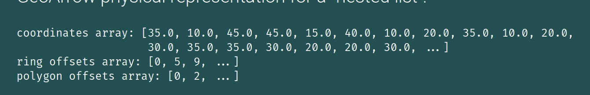
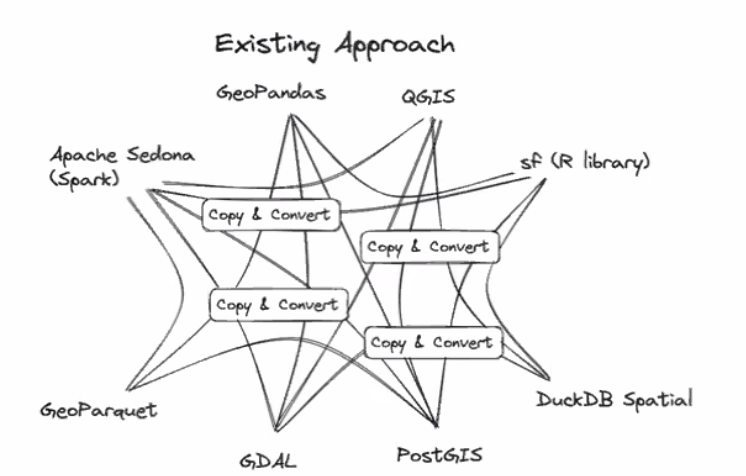
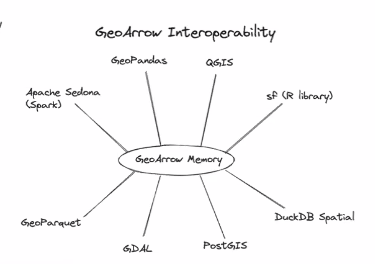
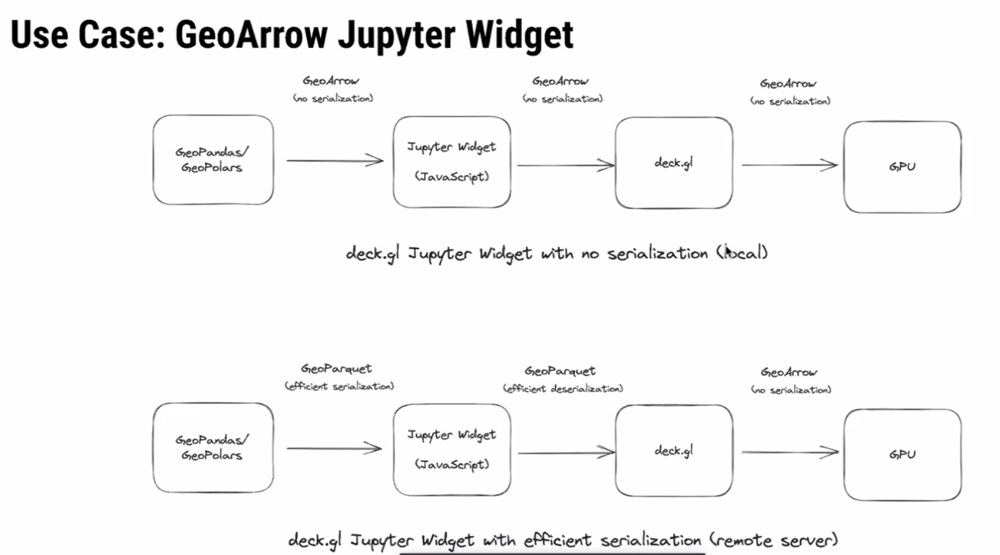
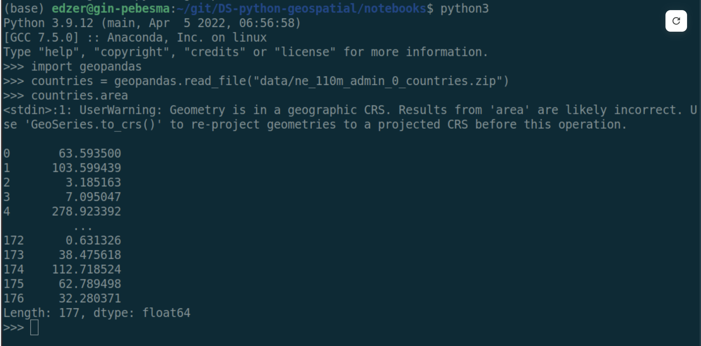
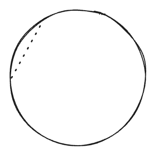

I feel very fortunate to have been invited to the first Spatial Data Science Across Languages (SDSL) workshop at the University of Münster. I am even more fortunate that I have an employer who sees the value in an event such as this and be my patron for it.

The event brought together package maintainers from Julia, Python, and R languages to just *discuss*. The event was loosely framed around a few broad discussion topics that were varied and drifted.

In general, the theme of the workshop was "standards." We need standards be able to ensure cohesion not only *within* languages, but across them. Users should be able to move between languages and be able to expect similar behavior, have similar terminology, and expect the same analysis results.

## Arrow

We started everything off by discussing Arrow which set the theme of "standards." Arrow gets conflated at many thing all at once---I do that. At the core Arrow is a memory format specification. It describes how data should be held in memory.

R holds objects in memory one way, Python another, and Julia another as well. Arrow describes just one way that specific types of object can be held in memory. GeoArrow is an extension of Arrow that specifies the memory layout for geometry arrays.

### GeoArrow

Specifications like well-known text (WKT) and well-known binary (WKB) are encodings of a *single* geometry. GeoArrow recognizes that we almost never work with scalar objects alone. GeoArrow is a memory layout for an array of geometries.

If each language can hold Arrow arrays in memory, they can be passed from one tool to another with 0 cost. Python can create an arrow array and R can pick it up if it knows where it exists.

The current approach looks something like this. Each tool serializes its data in one way. In order for another tool to use it, the data needs to be copied (memory inefficient) and converted (computationally expensive) into the appropriate format.

The Arrow specification would allow data handoff between tools to be much more seamless and look like so:

::: aside
Maybe we ought to start framing adoption of Arrow as an effort to be more "green." If we spend less time computing we use less energy which is overall a net positive for the world.
:::

This is a massive productivity improvement. There's no computation cost in converting between one format to another saving time, energy, and money.

::: aside
There's a good chance that in order to adopt Arrow in `{sf}` there will be breaking changes. I am an advocate for breaking changes when they are for a good reason. Being on the leading edge is how to make a language succeed.

I also think if we can move towards a "trait-driven" approach to spatial data frames, we can support both GeoArrow geometries as well as current `sfc` objects.

[Read my spatial data frame manifesto.](https://github.com/JosiahParry/sdf)
:::

The key thing though, is that in order for Arrow to be useful, **it has to be adopted widely**. If GeoPandas uses Arrow and `{sf}` does not, we have to go through the copy and convert process anyways.

### Why GeoArrow excites me

The promise of Arrow and GeoArrow is that memory can be handed off between tools without any additional cost. This (in theory) lowers the bar for what is needed to hand off between tools and languages. Hopefully [ending the language wars](https://wesmckinney.com/blog/the-problem-with-the-data-science-language-wars/)

[Kyle Barron](https://github.com/kylebarron) demonstrated really cool example use-case where he created GeoArrow arrays using [GeoPolars](https://github.com/geopolars/geopolars). That array was then written to a buffer and picked up by javascript. Since there was no serialization or deserialization it was unbelievably fast!

Additionally, we are seeing [WebAssembly](https://webassembly.org/) proliferate in the data science community. [WebR](https://webr.r-wasm.org/) provides R users with the ability to execute R in the browser. This is also possible in Python, Rust, Go, and I'm sure many others. Each language can be compiled to be used in the browser and hand off components between them.

Client side computation will reduce the need for server side operations. If we can reduce the amount of hours that servers are constantly running by offloading lighter operations into the browser, we may be able to save money, energy, be more green, and create tools that do not necessarily require an active internet connection.

## Spatial Support

We also discussed the more esoteric topic of **spatial support**. This was completely new to me. Support defines the relationship between an attribute to the geometry. There are two kinds:

-   **point support** - a constant values associated with every location in a geometry
    -   *example*: temperature measurement at a weather station
-   **block support** - a value derived from aggregating measures over space
    -   *example*: population count in a census tract

::: callout-tip
Read [chapter 1.6 of Spatial Data Science](https://r-spatial.org/book/01-hello.html#sec-support) (SDS) for more on this topic.
:::

When geometries are manipulated and the associated attributes come along for the ride, support assumptions are often violated resulting in inaccurate calculations or maps.

### Attribute-Geometry Relationships

SDS formalizes the relationship between attributes and geometry a bit further in something they call the **Attribute-Geometry Relationship (AGR)**. Attributes of spatial features can have one of 3 types of AGR:

-   constant value (i.e. point support)
-   aggregate value (i.e. block support)
-   identity (i.e. attribute unique to a geometry)

Knowing the relationships between geometries can be useful in tracking the assumptions of analyses. For example, taking the mean of an *aggregate* attribute such as median age, creates as assumptions of homogeneity in the aggregated areas and can contribute to the [modifiable areal unit problem (MAUP)](https://en.wikipedia.org/wiki/Modifiable_areal_unit_problem).

### Intensive vs Extensive

Spatial intensive vs extensive variables were also discussed in the context of spatial interpolation. I'm still quite unclear on how to conceptualize intensive and extensive variables. [Tobias G](https://github.com/MobiTobi) pointed out that these terms come from physics and provided a useful non-geometry motivating example.

> "The price of an ingot of gold is an extensive property and its temperature would be intensive."

::: aside
The common example is that population is extensive and population density is intensive. This requires the assumption that population is *constant* across space. So the examples are more confusing than helpful. I have yet to come up with an example of a spatially intensive variable that makes sense.

If you can think of one, please comment on below!
:::

**Extensive** variables are one that are associated with the physical geometry itself. **Intensive** ones *do not* change when a geometry is modified.

If an ingot of gold is split into half the price changes, each piece is now worth less than the whole. But, assuming the room temperature didn't change, the temperature of each piece remained the same.

### Domains

These properties of attributes are quite important but are forgotten about. One of the ideas raised in discussions was adding attribute-geometry relationship and a flag like `is_intensive` to a field domain.

A [Domain](https://desktop.arcgis.com/en/arcmap/latest/manage-data/geodatabases/an-overview-of-attribute-domains.htm) is a concept that *I think* originated at Esri. It allows you to specify the field type, range of valid values, as well as policies that determine how fields behave when they are split or merged. [Field domains were added to GDAL in version 3.3](https://github.com/OSGeo/gdal/releases/tag/v3.3.0).

Is there utility in adding `AGR` and (ex/in)tensive flags to a field domain?

::: aside
Arrow allows for embedded metadata at an array and table level. Perhaps there should be a GeoArrow table (data frame) format spec too? I'd like that. It would fit with my generic spatial data frame manifesto as well.
:::

## Geodesic first

A good amount of attention was paid to geodesic coordinate operations. The conversation was kicked off by this "motivating example."

::: aside
Really, I think this was just an excuse for Edzer to poke fun at the GeoPandas devs! 😵‍💫🤣
:::

The example shows an area calculation on a dataset that uses a geographic coordinate system (GCS). Area, though, is typically calculated under the assumption that coordinates are on a plane (rectangle). With GCS, the data is on a circle. So if we calculate the area of angles the result is *definitely wrong*.

::: aside
I think about it like calculating the area but cutting through the Earth like so: 
:::

The open source ecosystem is behind on support of geodetic calculations. Data more often than not is captured using GCS and users often fail to project their data. It would be nice if tools did this.

R supports spherical geometries by using [Google's S2 library](https://r-spatial.github.io/s2/). Python is presently building out support for S2. Some operations like buffering still aren't made available by S2.

### The "full polygon"

One interesting point that was brought up is that in a GCS there is a concept of a **full polygon**. This is the polygon that covers the entire ellipsoid. There is no way to capture this using typical coordinates.

## Spatial Weights Matrix Serialization

Probably the second most interesting topic to me was around how to store spatial weights matrixes. We didn't really discuss the "how" of holding it memory. Though I think they can be held in memory as a ragged Arrow array of indices or IDs. What was quite interesting was the concept of *serializing* the spatial weights matrix.

[Martin](https://martinfleischmann.net/) mentioned that in Pysal they had moved to serializing spatial weights as a parquet file which greatly improved their speed. In essence, spatial weights are stored in a 3 column table.

:::{.aside}

| i   | j   | wij  |
|-----|-----|------|
| 1   | 3   | 0.5  |
| 1   | 2   | 0.75 |
| 1   | 9   | 0.3  |
| 2   | 7   | 0.2  |

: Spatial Weights Matrix
:::

It was noted that additional metadata can be associated at the table level or column level. This can be very handy to keep track of things like the method for identifying neighbors, the weighting mechanism used, storing flags to know if the focal feature is included and maybe even remove weights if there is a constant value. 

Additionally, since this is parquet, it can be handled and stored by a number of databases.

One benefit of using arrow here, is that we can conceivably have a future where spatial weights matrices are interchangeable between spdep, pysal, geoda, and ArcGIS.

## Closing 

I'm about to hop on a flight back to the US now—10 hours without internet is going to be a test of monk-like fortitude. I have left my strongest feels for another time. Chatting with devs from other languages makes is clear how great CRAN is as a package storage and testing mechanism but yet how utterly abysmal it is as a developer. I will write another post soon on the topics of retirement and how I think we can make CRAN a better place for developers. 

## Additional links {#links}

I'll add more here as I can (hopefully).

- [Martin's SDSL blog post](https://martinfleischmann.net/a-note-on-spatial-data-science-across-languages-vol.1/)
