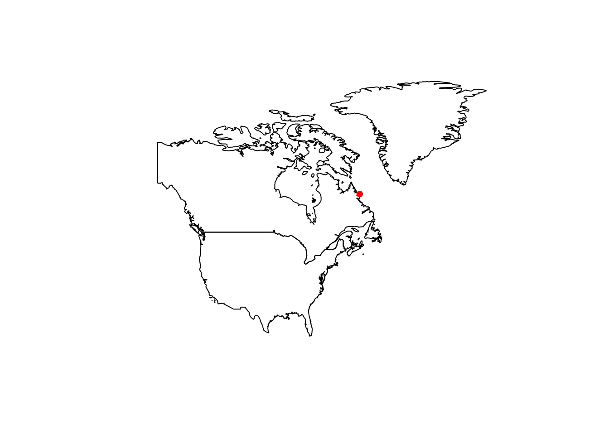

When I was flying back from the Spatial Data Science Across Langauge event from
Frankfurt to Atlanta the plane I was bored beyond measure. The plane had no 
wifi to connect to. I had already watched a movie and couldn't be bothered by
a podcast. I wanted to know where I was. 

When looking at the onboard "About this flight" information, they didn't show
a map even. The gave us our coordinates in degrees and minutes. Helpful right? 

Well, in an attempt to figure out where the hell I was I wrote some code. Here
it is.


::: {.cell}

```{.r .cell-code}
library(sf)
```

::: {.cell-output .cell-output-stderr}
```
Linking to GEOS 3.11.0, GDAL 3.5.3, PROJ 9.1.0; sf_use_s2() is TRUE
```
:::

```{.r .cell-code}
library(units)
```

::: {.cell-output .cell-output-stderr}
```
udunits database from /Library/Frameworks/R.framework/Versions/4.3-arm64/Resources/library/units/share/udunits/udunits2.xml
```
:::

```{.r .cell-code}
#' Given degrees and minutes calculate the coordinate
#' in degrees
as_degree <- function(degrees, minutes) {
  d <- set_units(degrees, "arc_degrees")
  m <- set_units(minutes, "arc_minutes") |> 
    set_units("arc_degrees")
  d + m
}

# get the country shapes
x <- rnaturalearthdata::countries50 |>  st_as_sf() 

# filter to North America
usa <- x |> 
  dplyr::filter(continent == "North America", 
                subregion == "Northern America") |> 
  st_geometry() 

# Create a bounding box to crop myself to 
crp <- st_bbox(c(xmin = -128, xmax = 0, ymin = 18, ymax = 61))

# plot N. America
usa |> 
  st_cast("POLYGON") |> 
  st_as_sf() |> 
  st_filter(
    st_as_sfc(crp) |> 
      st_as_sf(crs = st_crs(usa))
    ) |>
  plot()


# add planes location.
plot(
  st_point(c(-as_degree(61, 19), as_degree(57, 46))),
  add = TRUE,
  col = "red",
  pch = 16
)
```

::: {.cell-output-display}
{width=672}
:::
:::
